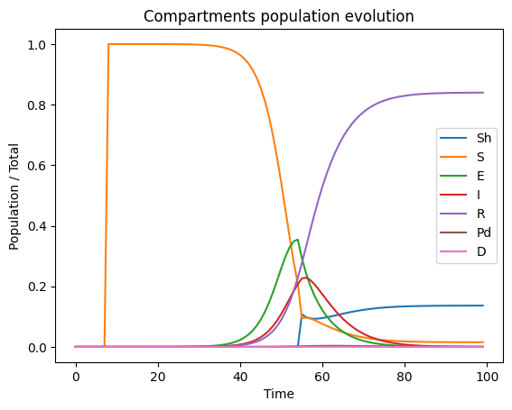
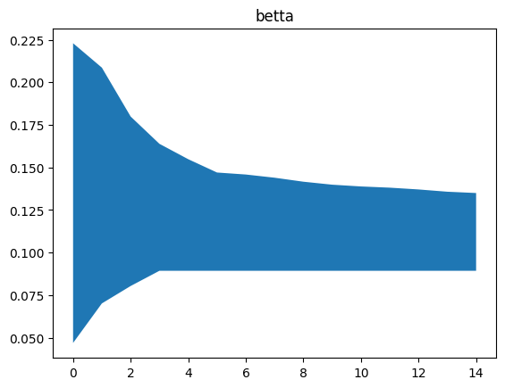
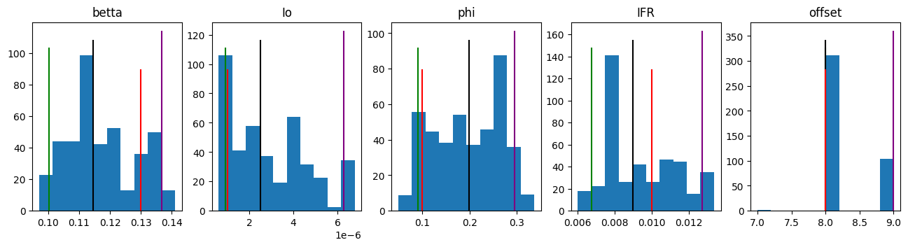

<!-- Copyright 2023 Unai Lería Fortea

Licensed under the Apache License, Version 2.0 (the "License");
you may not use this file except in compliance with the License.
You may obtain a copy of the License at

    http://www.apache.org/licenses/LICENSE-2.0

Unless required by applicable law or agreed to in writing, software
distributed under the License is distributed on an "AS IS" BASIS,
WITHOUT WARRANTIES OR CONDITIONS OF ANY KIND, either express or implied.
See the License for the specific language governing permissions and
limitations under the License. -->

This examples follows the model exposed in my [Physics Undergraduate Thesis Project (2021-2022)](https://deposita.unizar.es/record/69350?ln=es) whose code can be found 
[GitHub repository](https://github.com/QuanticPony/Analysis-of-effectiveness-of-lockdown-policies-for-desease-containment).


The main equations of the model are the following:
$$
\begin{align}
    \tag{4.5} S_h[t+1]    &= S_T[t] \cdot (1-p(t))sh (1-\phi)\\
    \tag{4.6} S[t+1]      &= (S_T[t] - S_h[t]) \cdot (1- P_{infection})\\
    \tag{4.7} E[t+1]      &= (S_T[t]-S_h[t]) \cdot P_{infection} + (1-\eta)\cdot E[t]\\
    \tag{4.8} I[t+1]      &= \eta \cdot E[t]  + (1- \mu)\cdot I[t]\\
    \tag{4.9} R[t+1]      &=  \mu (1-IFR) \cdot I[t]  + R[t] \\
    \tag{4.10} P_d[t+1]    &=  \mu IFR \cdot I[t] + (1-\xi)\cdot P_d[t] \\
    \tag{4.11} D[t+1]      &= \xi\cdot P_d[t] + D[t] 
\end{align}
$$

Where:
$$
\begin{equation} \tag{4.3}
    P_{infection} = p(t)\cdot P_{infection}^{active} + (1-p(t))(1-sh(1-\phi))\cdot P_{infection}^{lockdown},
\end{equation}
$$

$$
\begin{equation*}
    P_{infection}^{j} = 1- \left(1-\lambda\frac{I}{N}\right)^{\left<k_j\right>}; \quad \textrm{with} \quad j=active, lockdown.
\end{equation*}
$$

The configuration could be:

```json
model = {
    "simulation": {
        "n_simulations": 100000,
        "n_executions": 1,
        "n_steps": 100
    },
    "compartments": {
        "Sh": { "initial_value": 0 },
        "S": { 
            "initial_value": 1,
            "minus_compartments": "I"
        },
        "E": { "initial_value": 0 },
        "I": { 
            "initial_value": "Io",
        },
        "R": { "initial_value": 0 },
        "Pd": { "initial_value": 0 },
        "D": { "initial_value": 0 },
    },
    "params": {
        "betta": {
            "min": 0.01,
            "max": 0.3,
            "min_limit": 0.01, // (1)
            "max_limit": 0.3
        },
        "Io": {
            "min": 1e-8,
            "max": 1e-5,
            "min_limit": 0,
            "max_limit": 1e-4
        },
        "phi": {
            "min": 0,
            "max": 0.5,
            "min_limit": 0,
            "max_limit": 1
        },
        "IFR": {
            "min":0.006,
            "max":0.014,
            "min_limit": 0.006,
            "max_limit": 0.014
        },
        "offset": {
            "type": "int", // (2)
            "min":5,
            "max":10,
            "min_limit": 0,
            "max_limit": 10
        }
    },
    "fixed_params": {
        "K_active": 12.4,
        "K_lockdown": 2.4,
        "sigma": 3.4,
        "mu": 1/4.2,
        "eta":1/5.2,
        "xi":1/10,
    },
    "reference": {
        "compartments" : ["D"],
        "offset": "offset" // (3)
    },
    "results": { 
        "save_percentage": 0.5
    }
}
```

1. `min_limit` and `max_limit` are the absolute limits in the automatic adjustment
2. This `offset` parameter will be used as an offset between the simulated data and the reference data
3. An offset can be applied to the reference while comparing it with the simulation data. Can be an interger or a parameter name defined in `params` 

Now we need to define the evolution function of the system and assign it to the model. In this case the evolution function is a lot more complicated than in previous examples. 

> **Note:** In case of complex problems like this it may be needed to write `[:]` on values assignation. 


```py
import compartmental
compartmental.use_numpy()
# compartmental.use_cupy() # For GPU usage

MyModel = compartmental.GenericModel(model)

def evolve(m, time, p_active, *args, **kargs):
    ST = m.S + m.Sh
    sh = (1 - m.I) ** (m.sigma - 1)

    P_infection_active = 1- (1- m.betta * m.I) ** m.K_active
    P_infection_lockdown = 1- (1- m.betta * m.I) ** m.K_lockdown

    P_infection = p_active[time] * P_infection_active + (1-p_active[time]) * (1-sh*(1-m.phi)) * P_infection_lockdown


    m.Sh[:]    = ST * (1-p_active[time])*sh*(1-m.phi)
    delta_S = ST * P_infection
    m.S[:]     = (ST - m.Sh)  - delta_S
   
    m.D[:]     = m.xi * m.Pd
    m.R[:]     = m.mu * (1-m.IFR)  * m.I + m.R
    m.Pd[:]    = m.mu * m.IFR  * m.I + (1-m.xi) * m.Pd
    m.I[:]     = m.eta  * m.E + (1- m.mu) * m.I
    m.E[:]     = delta_S + (1-m.eta) * m.E
    
MyModel.evolve = evolve
```

For this example we will use a `p_active` defined as follows:
```py
p_active = [1 if t<35 else 0.1 for t in range(model["simulation"]["n_steps"])]
```

Once the model is defined and the evolution function is set we can create a trajectory of the model. We can set specific values for the random parameters as follows:

```py
sample, sample_params = compartmental.util.get_model_sample_trajectory(
    MyModel, p_active,
    **{"betta": 0.13,
        "Io": 1e-6,
        "phi": 0.1,
        "IFR": 0.01,
        "offset": 8} # (1)
)

reference = numpy.copy(sample[MyModel.compartment_name_to_index["D"]])
```
1. Here the offset will be used to automatically offset the values because the parameter `offset` is defined as the reference's offset in the model configuration.

Plotting the `sample` yields:

```py
import matplotlib.pyplot as plt
list_of_sample_lines = []
_range = numpy.arange(model["simulation"]["n_steps"])

for s in sample:
    list_of_sample_lines.append(_range)
    list_of_sample_lines.append(s)
    list_of_sample_lines.append('-')
    
sample_lines = plt.plot(*list_of_sample_lines)
for line, compartment in zip(sample_lines, model["compartments"]):
    line.set_label(compartment)

plt.title("Compartments population evolution")
plt.xlabel("Time")
plt.ylabel("Population / Total")
plt.legend()
plt.show()
```



________
Now we can use the `sample` and try to infer the values of $\beta$, $Io$, $\phi$, $IFR$ and the `offset`:

```py
ITERS = 15

# Main loop of adjustments:
# 1. Run
# 2. Read results
# 3. Compute weights
# 4. Adjuts configuration
for i in range(ITERS):
    MyModel.run(reference, f"my_model{i}.data", p_active)
    
    results = compartmental.util.load_parameters(f"my_model{i}.data")
    
    weights = numpy.exp(-2*results[0]/numpy.min(results[0]))

    compartmental.util.auto_adjust_model_params(MyModel, results, weights)


# Update for final photo with more simulations
MyModel.configuration.update({
    "simulation": {
        "n_simulations": 1000000,
        "n_executions": 4,
        "n_steps": 100
    },
    "results": {
        "save_percentage": 0.01
    }
})

MyModel.run(reference, "my_model.data", p_active)
```


Finnally we can plot the results:

```py
results = compartmental.util.load_parameters("my_model.data")
weights = numpy.exp(-2*results[0]/numpy.min(results[0]))
weights /= numpy.min(weights)

percentiles = compartmental.util.get_percentiles_from_results(MyModel, results, 30, 70, weights, p_active, weights)
try:
    # In case cupy is used
    percentiles = percentiles.get()
    sample = sample.get()
    weights = weights.get()
    results = results.get()
    sample_params = sample_params.get()
except AttributeError:
    pass

# Plot sample with a shadow of the results.
plt.figure()
plt.fill_between(numpy.arange(percentiles.shape[2]), percentiles[0,0], percentiles[0,2], alpha=0.3)
plt.xlabel("Simulation time")
plt.ylabel("Daily Deaths / Total population")
plt.plot(reference, 'black')
plt.plot(numpy.arange(percentiles.shape[2]), percentiles[0,1], '--', color='purple')
tax = plt.twinx()
tax.plot(p_active, ':', color='green')
tax.set_ylabel(r"$p(t)$")

# Histograms with infered likelihood of the parameters
fig, *axes = plt.subplots(1, len(results)-1)
fig.set_figheight(3.5)
fig.set_figwidth(16)
for i, ax in enumerate(axes[0], 1):
    _5, _50, _95 = compartmental.util.weighted_quantile(results[i], [5, 50, 95], weights)
    for k, index in MyModel.param_to_index.items():
        if index == i-1:
            ax.set_title(k)
    ax.hist(results[i], weights=weights)
    
    ax.vlines(_5, *ax.get_ylim(), 'green')
    ax.vlines(_50, *ax.get_ylim(), 'black')
    ax.vlines(_95, *ax.get_ylim(), 'purple')

    ax.vlines(sample_params[i-1], ax.get_ylim()[0], ax.get_ylim()[1]*3/4, 'red')
    

plt.show()
```



