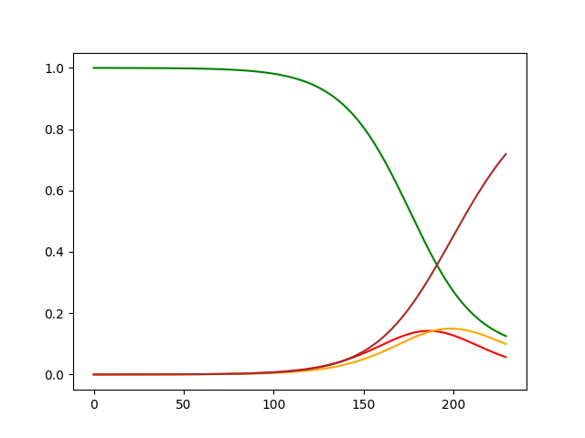
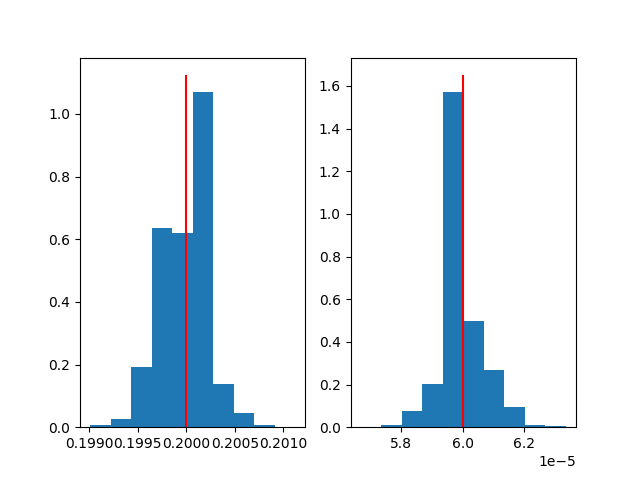

<!-- Copyright 2023 Unai Lería Fortea

Licensed under the Apache License, Version 2.0 (the "License");
you may not use this file except in compliance with the License.
You may obtain a copy of the License at

    http://www.apache.org/licenses/LICENSE-2.0

Unless required by applicable law or agreed to in writing, software
distributed under the License is distributed on an "AS IS" BASIS,
WITHOUT WARRANTIES OR CONDITIONS OF ANY KIND, either express or implied.
See the License for the specific language governing permissions and
limitations under the License. -->

# Work in progress

$$
\begin{equation} \tag{4.3}
    P_{infection} = p(t)\cdot P_{infection}^{active} + (1-p(t))(1-sh(1-\phi))\cdot P_{infection}^{lockdown},
\end{equation}
$$
$$
\begin{equation*}
    P_{infection}^{j} = 1- \left(1-\lambda\frac{I}{N}\right)^{\left<k_j\right>}; \quad \textrm{with} \quad j=active, lockdown.
\end{equation*}
$$

$$
\begin{align}
    \tag{4.5} S_h[t+1]    &= S_T[t] \cdot (1-p(t))sh (1-\phi)\\
    \tag{4.6} S[t+1]      &= (S_T[t] - S_h[t]) \cdot (1- P_{infection})\\
    \tag{4.7} E[t+1]      &= (S_T[t]-S_h[t]) \cdot P_{infection} + (1-\eta)\cdot E[t]\\
    \tag{4.8} I[t+1]      &= \eta \cdot E[t]  + (1- \mu)\cdot I[t]\\
    \tag{4.9} R[t+1]      &=  \mu (1-IFR) \cdot I[t]  + R[t] \\
    \tag{4.10} P_d[t+1]    &=  \mu IFR \cdot I[t] + (1-\xi)\cdot P_d[t] \\
    \tag{4.11} D[t+1]      &= \xi\cdot P_d[t] + D[t] 
\end{align}
$$


```json
model = {
    "simulation": {
        "n_simulations": 1000000,
        "n_executions": 1,
        "n_steps": 230
    },
    "compartments": {
        "Sh": { "initial_value": 0 },
        "S": { 
            "initial_value": 1,
            "minus_compartments": "I"
        },
        "E": { "initial_value": 0 },
        "I": { 
            "initial_value": "Io",
        },
        "R": { "initial_value": 0 },
        "Pd": { "initial_value": 0 },
        "D": { "initial_value": 0 },
    },
    "params": {
        "betta": {
            "min": 0.01,
            "max": 0.3
        },
        "Io": {
            "min": 1e-6,
            "max": 1e-4
        },
        "phi": {
            "min": 0,
            "max": 1
        },
        "IFR": {
            "min":0.006,
            "max":0.014
        },
        "xi": {
            "min":1/16,
            "max":1/6
        }
    },
    "fixed_params": {
        "K_active": 12.4,
        "K_lockdown": 2.4,
        "sigma": 3.4,
        "mu": 1/4.2,
        "eta":1/5.2
    },
    "reference": {
        "compartments" : ["D"],
        "offset": "offset" 
    },
    "results": { 
        "save_percentage": 0.01
    }
}
```


Now we need to define the evolution function of the system and assign it to the model:
```py
import compartmental as gcm
gcm.use_numpy()
# gcm.use_cupy() # For GPU usage

MyModel = gcm.GenericModel(model)

def evolve(m, *args, **kargs):
    p_infected = m.betta * m.K_mean * m.I
    
    m.R += m.mu * m.I
    m.I += m.E * m.eta - m.I * m.mu
    m.E += m.S * p_infected - m.E * m.eta
    m.S -= m.S * p_infected
    
MyModel.evolve = evolve
```

Once the model is defined and the evolution function is set we can create a trajectory of the model. We can set specific values for the random parameters as follows:

```py
sample, sample_params = gcm.util.get_model_sample_trajectory(
    MyModel, 
    **{"betta": 0.2, "Io":6e-5}
)
```
Plotting the `sample` yields:

```py
import matplotlib.pyplot as plt
plt.plot(sample[MyModel.compartment_name_to_index["S"]], 'green')
plt.plot(sample[MyModel.compartment_name_to_index["E"]], 'red')
plt.plot(sample[MyModel.compartment_name_to_index["I"]], 'orange')
plt.plot(sample[MyModel.compartment_name_to_index["R"]], 'brown')
plt.show()
```



________
Now we can use the `sample` and try to infer the values of $\beta$ and $Io$. 

```py
MyModel.run(sample[MyModel.compartment_name_to_index["R"]], "seir.data")
```
The results are save in the `seir.data` file. We load them, compute the weights and the percentiles `30` and `70` with:
```py
results = gcm.util.load_parameters("seir.data")
weights = numpy.exp(-results[0]/numpy.min(results[0]))

percentiles = gcm.util.get_percentiles_from_results(MyModel, results, 30, 70)
```

Finally plot the reference values with the percentiles and histograms for the parameters  $\beta$ and $Io$ (the red line indicates the value used for the reference):
```py
plt.figure()
plt.fill_between(numpy.arange(percentiles.shape[2]), percentiles[0,0], percentiles[0,2], alpha=0.3)
plt.plot(sample[MyModel.compartment_name_to_index["R"]], 'black')
plt.plot(numpy.arange(percentiles.shape[2]), percentiles[0,1], '--', color='purple')

fig, *axes = plt.subplots(1, len(results)-1)
for i, ax in enumerate(axes[0], 1):
    ax.hist(results[i], weights=weights)
    ax.vlines(sample_params[i-1], *ax.get_ylim(), 'red')
    
plt.show()
```



We could also see specific simulations with:
```py
values = compartmental.util.get_trajecty_selector(
    MyModel, results, weights, sample[MyModel.compartment_name_to_index["D"]], p_active, show_only_reference=True
)
print(values)
plt.show(block=True)
```