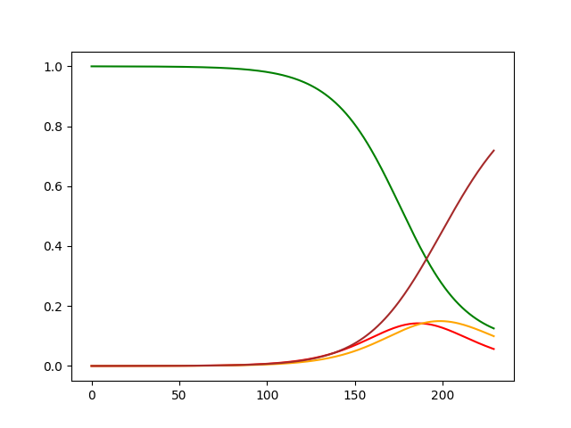
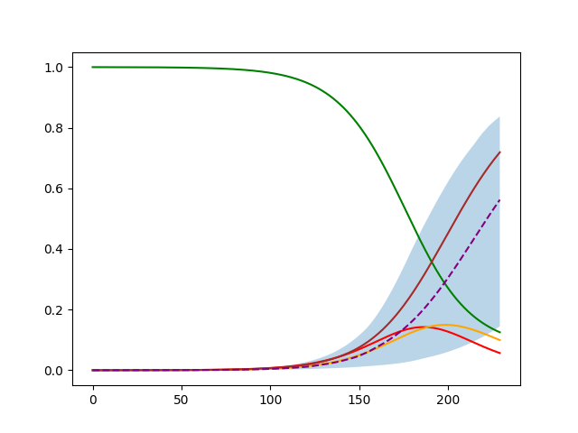
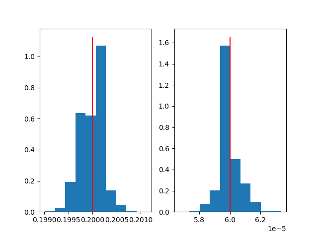

<!-- Copyright 2023 Unai Lería Fortea

Licensed under the Apache License, Version 2.0 (the "License");
you may not use this file except in compliance with the License.
You may obtain a copy of the License at

    http://www.apache.org/licenses/LICENSE-2.0

Unless required by applicable law or agreed to in writing, software
distributed under the License is distributed on an "AS IS" BASIS,
WITHOUT WARRANTIES OR CONDITIONS OF ANY KIND, either express or implied.
See the License for the specific language governing permissions and
limitations under the License. -->


$$
\begin{align}
    \nonumber \dot{S} &= -\beta \langle k \rangle \frac{I}{N}S. \\
    \nonumber \dot{E} &=  \beta \langle k \rangle \frac{I}{N}S - \eta E. \\
    \nonumber \dot{I} &= \eta E - \mu I. \\
    \nonumber \dot{R} &= \mu I.
\end{align}
$$


```json
seir_model = {
    "simulation": { // (1)
        "n_simulations": 1000000, // (2)
        "n_executions": 1, // (3)
        "n_steps": 230 // (4)
    },
    "compartments": { // (5)
        "S": { 
            "initial_value": 1, // (6)
            "minus_compartments": "I" // (7)
        },
        "E": { "initial_value": 0 },
        "I": { 
            "initial_value": "Io", // (8)
        },
        "R": { "initial_value": 0 },
    },
    "params": { // (9)
        "betta": {
            "min": 0.1, // (10)
            "max": 0.3
        },
        "Io": {
            "min": 1e-6,
            "max": 1e-4
        }
    },
    "fixed_params": { // (11)
        "K_mean": 1,
        "mu": 0.07,
        "eta":0.08
    },
    "reference": { // (12)
        "compartments" : ["R"]
    },
    "results": { 
        "save_percentage": 0.01 // (13)
    }
}
```

1.  Here we define simulation parameters
2.  How many simulations to do in parallel each execution
3.  Number of times the simulation runs
4.  Number of times the evolution function is executed each simulation

5.  Here we define the compartments of the model. Each field must be unique
6.  Initial value set to a fixed number
7.  You subtract the value of other compartments after all of them are initialized
8.  You can set the initial value of compartments as parameters

9.  Here we define parameters that will be randomly generated for each simulation. Each field must be unique
10. A min value and max value must be set for each parameter

11. Definition of constant for all the simulations

12. Definition of which compartments the results should be compared with

13. Percentage of simulations that will be saved. The best of course

Now we need to define the evolution function of the system and assign it to the model:
```py
import compartmental as gcm
gcm.use_numpy()
# gcm.use_cupy() # For GPU usage

SeirModel = gcm.GenericModel(seir_model)

def evolve(m, *args, **kargs):
    p_infected = m.betta * m.K_mean * m.I
    
    m.R += m.mu * m.I
    m.I += m.E * m.eta - m.I * m.mu
    m.E += m.S * p_infected - m.E * m.eta
    m.S -= m.S * p_infected
    
SeirModel.evolve = evolve
```

Once the model is defined and the evolution function is set we can create a trajectory of the model. We can set specific values for the random parameters as follows:

```py
sample, sample_params = gcm.util.get_model_sample_trajectory(
    SeirModel, 
    **{"betta": 0.2, "Io":6e-5}
)
```
Plotting the `sample` yields:

```py
import matplotlib.pyplot as plt
plt.plot(sample[SeirModel.compartment_name_to_index["S"]], 'green')
plt.plot(sample[SeirModel.compartment_name_to_index["E"]], 'red')
plt.plot(sample[SeirModel.compartment_name_to_index["I"]], 'orange')
plt.plot(sample[SeirModel.compartment_name_to_index["R"]], 'brown')
plt.show()
```



________
Now we can use the `sample` and try to infer the values of $\beta$ and $Io$. 

```py
SeirModel.run(sample[SeirModel.compartment_name_to_index["R"]], "seir.data")
```
The results are save in the `seir.data` file. We load them, compute the weights and the percentiles `30` and `70` with:
```py
results = gcm.util.load_parameters("seir.data")
weights = numpy.exp(-results[0]/numpy.min(results[0]))

percentiles = gcm.util.get_percentiles_from_results(SeirModel, results, 30, 70)
```

Finally plot the reference values with the percentiles and histograms for the parameters  $\beta$ and $Io$ (the red line indicates the value used for the reference):
```py
plt.figure()
plt.fill_between(numpy.arange(percentiles.shape[2]), percentiles[0,0], percentiles[0,2], alpha=0.3)
plt.plot(sample[SeirModel.compartment_name_to_index["R"]], 'black')
plt.plot(numpy.arange(percentiles.shape[2]), percentiles[0,1], '--', color='purple')

fig, *axes = plt.subplots(1, len(results)-1)
for i, ax in enumerate(axes[0], 1):
    ax.hist(results[i], weights=weights)
    ax.vlines(sample_params[i-1], *ax.get_ylim(), 'red')
    
plt.show()
```

